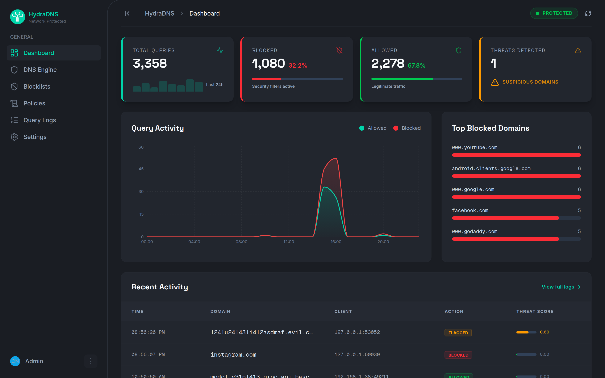
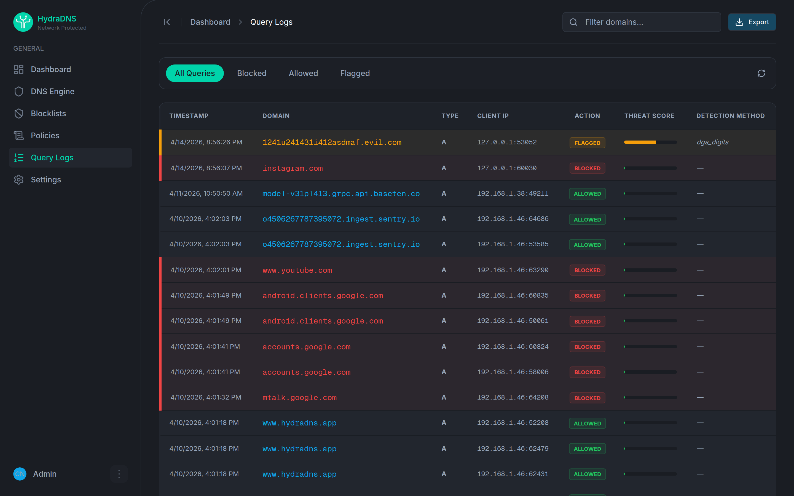
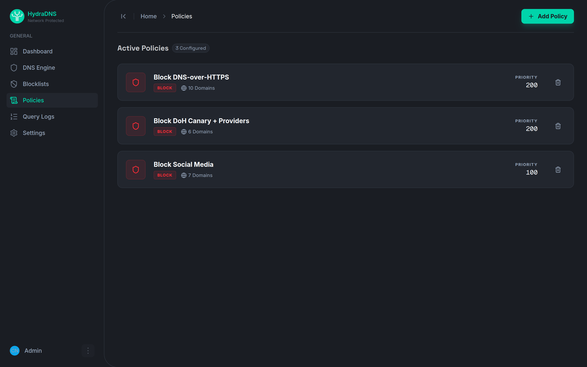

# HydraDNS

**A self-hosted DNS firewall you can manage by talking to an AI agent.** Block ads, malware, and trackers at the DNS level like Pi-hole, rebuilt in Go with an API-first control plane and a built-in Model Context Protocol server, so Claude or any MCP agent can run your network for you.


[](https://go.dev)
[](https://nextjs.org)
[](https://docs.docker.com/compose/)
[](https://github.com/hydradns/hydradns/actions/workflows/ci.yml)
[](LICENSE)

**[Screenshots and product site at hydradns.app](https://hydradns.app)** (a marketing site with static screenshots, not an interactive demo)



---

## HydraDNS vs Pi-hole

| | HydraDNS | Pi-hole |
|:--|:--|:--|
| Core | Go, gRPC control/data plane split | C (pihole-FTL), embedded web server |
| Setup | `docker compose up -d` builds core + dashboard from source and starts both | installer script or Docker |
| AI management (MCP) | ✅ built in (`hydra mcp`, 14 tools: block/unblock, policies, logs, metrics, anomaly explain) | ❌ third-party community bridges only |
| DoH bypass blocking | ✅ curated DoH bootstrap endpoints blocked at query time | ⚠️ Firefox canary domain only; add third-party lists for the rest |
| Policies | priority-based allow/block/redirect via API or UI; CLI covers block/unblock/list/delete (no generic create yet) | groups, regex, and per-client rules (more mature today) |
| Maturity | young, pre-1.0, moving fast | 10+ years, huge community, built-in DHCP |

Choose Pi-hole today for battle-tested stability, regex rules, and community support. Choose HydraDNS for a hackable Go codebase, an API-first control plane, and AI-agent management over MCP that self-hosted alternatives only get through third-party bridges.

Honest limits: like every DNS-layer filter, HydraDNS cannot stop a client that hardcodes a DoH server by raw IP. Pair it with a firewall rule on 443/853 to close that path. For the fuller list — no TLS on the dashboard/gRPC yet, no DNSSEC, regex/wildcard policies not enforced, and more — see [docs/limitations.md](docs/limitations.md).


---

## Why HydraDNS

I spent 15 months building an enterprise next-generation firewall in Go, and kept
wishing the self-hosted version of that tooling existed: something a home or
small-office network could run, with a real API and a control plane you could
drive from a script or an AI agent instead of a settings page. HydraDNS is that
tool. The built-in Model Context Protocol server comes from the same work I do
upstream as a CNCF Jaeger contributor, where I build MCP tooling for observability.

It is pre-1.0 and moving fast. If it is useful to you, a star and an issue both help.

Built by Roshan Singh ([@lopster568](https://github.com/lopster568)).

---

## Quick Start

```bash
# Clone (single repo, no submodules)
git clone https://github.com/hydradns/hydradns.git
cd hydradns

# Start everything
docker compose up -d

# Verify DNS is working
dig @localhost example.com

# Check the dashboard
open http://localhost:3000
```

> **Port 53 already in use?** On Linux or WSL2, `systemd-resolved` may already hold port 53.
> Free it before starting: `sudo systemctl disable --now systemd-resolved` (then set a DNS
> server in `/etc/resolv.conf`), or edit the port mapping in `docker-compose.yml`.
> See [docs/pi-deployment.md](docs/pi-deployment.md) for details.

That's it. DNS filtering is active. Give this machine a static IP and point your router's DNS to it — see [docs/pi-deployment.md](docs/pi-deployment.md) for static IP setup on Linux, macOS, and Windows plus per-router DNS instructions.

---

## Architecture

```
                    +-----------+
                    |  Browser  |
                    +-----+-----+
                          |
                    +-----v-----+
                    |  Dashboard |  :3000  (Next.js)
                    +-----+-----+
                          |
                    +-----v-----+
         +--------->  Control   |  :8080  (Go + Gin REST API)
         |          |   Plane   |
         |          +-----+-----+
         |                |  gRPC :50051
         |          +-----v-----+
  CLI/MCP|          |   Data    |  :53    (DNS UDP/TCP)
  hydra  +--------->   Plane    |
                    +-----+-----+
                          |
               +----------+----------+
               |          |          |
          +----v---+ +----v---+ +----v---+
          |Blocklist| | Policy | |Upstream|
          | Engine  | | Engine | |Resolvers|
          +--------+ +--------+ +--------+
```

| Service | Directory | Tech | Port |
|:--------|:----------|:-----|:-----|
| Core (Control + Data Plane) | `apps/core` | Go 1.24, Gin, gRPC, GORM/SQLite | 8080, 53 |
| Dashboard | `apps/ui` | Next.js 16, React 19, TypeScript, Tailwind | 3000 |
| Scanner | `apps/scanner` | Go, network detection | — |
| CLI + MCP | `apps/cli` | Go, Cobra, JSON-RPC 2.0 | — |

### DNS Query Pipeline

Every DNS query is scored by a heuristic threat detector (domain entropy, DGA-pattern,
length, subdomain depth) — non-blocking, tags the query log only, no auto-block yet — then
goes through this pipeline with early exit:

1. **DoH bootstrap interception** — known DoH provider bootstrap hostnames get NXDOMAIN so browsers fall back to system DNS
2. **Blocklist check** — in-memory membership test; if the domain is blocked, respond per `BLOCK_RESPONSE` (default: A/AAAA → `0.0.0.0`/`::`; `nxdomain` and `refused` also available)
3. **Policy evaluation** — Bloom filter for O(1) negative lookup, then exact match. Highest priority wins
4. **Response cache** — TTL-respecting LRU for allowed queries; blocked/redirect responses are never cached
5. **Upstream forward** — pool-per-resolver with failover (1.5s per-attempt timeout, 2 retries)

---

## Dashboard

The web dashboard at `localhost:3000` lets you:

- View real-time query statistics (total, blocked, allowed, block rate)
- Toggle the DNS engine on/off
- Manage blocklist sources (add/remove/view domain counts)
- Create and delete DNS policies (block, allow, redirect)
- Search and filter query logs





---

## CLI

The `hydra` CLI wraps the control plane API for terminal-based management.

```bash
# Build the CLI
cd apps/cli && go build -o hydra .

# First boot: create the admin account and store the API token
hydra setup

# Check status
hydra status

# Block a domain
hydra block ads.example.com

# View query logs
hydra logs

# Manage blocklists
hydra blocklists
hydra blocklists add --id steven-black --name "StevenBlack" \
  --url "https://raw.githubusercontent.com/StevenBlack/hosts/master/hosts"

# Manage policies
hydra policies
hydra policies delete my-policy-id

# Engine control
hydra engine enable
hydra engine disable

# View metrics
hydra metrics
```

Set `HYDRA_API_URL` to point at a remote instance (default: `http://localhost:8080`).

---

## MCP Server (AI Integration)

HydraDNS includes a built-in [Model Context Protocol](https://modelcontextprotocol.io/) server, letting AI assistants manage your DNS firewall conversationally.

```bash
# Start MCP server (JSON-RPC 2.0 over stdio)
hydra mcp
```

### Claude Code Setup

Add to your Claude Code MCP config:

```json
{
  "mcpServers": {
    "hydradns": {
      "command": "/path/to/hydra",
      "args": ["mcp"],
      "env": {
        "HYDRA_API_URL": "http://localhost:8080"
      }
    }
  }
}
```

### Available MCP Tools

| Tool | Description |
|:-----|:------------|
| `get_status` | Engine status and query statistics |
| `toggle_engine` | Enable or disable DNS engine |
| `block_domain` | Block a domain (creates a policy) |
| `unblock_domain` | Remove a block policy |
| `list_policies` | List all DNS policies |
| `list_blocklists` | List blocklist sources |
| `get_query_logs` | Recent DNS query logs |
| `get_metrics` | Latency percentiles and performance grade |
| `create_policy` | Create an allow/block/redirect policy |
| `delete_policy` | Delete a policy by ID |
| `bulk_unblock` | Remove block policies for many domains at once |
| `get_weekly_summary` | Week-over-week query and block summary |
| `explain_anomaly` | Explain a block-rate or volume anomaly |
| `compare_to_last_month` | Compare current stats against the previous month |

**Example conversation:** "Block all social media domains" — Claude calls `block_domain` for each domain.

---

## Development

### Prerequisites

- Go 1.24+
- Node.js 20+
- Docker & Docker Compose

### Working on a Service

Each service lives under `apps/` in this repo. Work inside its directory:

```bash
cd apps/core
make build        # Compile controlplane & dataplane
make test         # Run tests with coverage
make fmt          # Format code
make vet          # Vet code
make lint         # golangci-lint

cd apps/ui
npm run dev       # Dev server on :3000
npm run build     # Production build

cd apps/cli
go build -o hydra .  # Build CLI binary
```

### Full Stack Commands (from root)

```bash
make setup        # One-time local setup (.env)
make start        # docker compose up -d
make stop         # docker compose down
make update       # git pull --ff-only
make logs         # Tail all logs
make build-core   # Rebuild core service
make restart-core # Rebuild + restart core
```

---

## Project Structure

```
hydradns/
├── apps/
│   ├── core/           # Go DNS engine + API
│   │   ├── cmd/        #   controlplane + dataplane binaries
│   │   ├── internal/   #   blocklist, dnsengine, policy, storage
│   │   ├── configs/    #   config.yaml + policies.json
│   │   └── proto/      #   gRPC protobuf definitions
│   ├── ui/             # Next.js dashboard
│   ├── scanner/        # Network detection worker
│   └── cli/            # CLI + MCP server
│       ├── cmd/        #   Cobra commands
│       ├── api/        #   HTTP client for control plane
│       └── mcp/        #   MCP JSON-RPC server
├── docker-compose.yml  # Full stack orchestration
├── Makefile            # Convenience commands
└── scripts/            # Setup scripts
```

---

## Deployment

### Docker Compose (recommended)

```bash
docker compose up -d
```

Core runs as a combined container (controlplane + dataplane) with:
- SQLite database persisted in a Docker volume
- Health check on `/health` endpoint
- Automatic blocklist fetching on startup

### Raspberry Pi / VPS

```bash
curl -fsSL https://raw.githubusercontent.com/hydradns/hydradns/main/scripts/install.sh | bash
```

Then give the device a static IP and point your router's DNS server to it. Full walkthrough (static IP on Linux/macOS/Windows, router config): [docs/pi-deployment.md](docs/pi-deployment.md).

---

## Documentation

- [Deployment Guide](docs/pi-deployment.md) — install on a Raspberry Pi or any always-on machine; static IP setup (Linux, macOS, Windows), per-router DNS configuration, troubleshooting
- [Hardware Guide](docs/hardware-guide.md) — choosing a device to run HydraDNS on
- [Known Limitations](docs/limitations.md) — what's not implemented yet, with impact and workarounds

---

## Configuration

| Env Variable | Default | Description |
|:-------------|:--------|:------------|
| `HYDRA_CONFIG` | `/app/configs/config.yaml` | Path to config file |
| `HYDRA_DB` | `/app/data/hydradns.db` | SQLite database path |
| `HYDRA_POLICIES` | `/app/configs/policies.json` | Policy file path |
| `CORS_ORIGINS` | `http://localhost:3000,http://127.0.0.1:3000` (compose sets `http://localhost:3000`) | Comma-separated allowed CORS origins |
| `CORS_ALLOW_SAME_HOST` | `true` | Also allow the dashboard when it is opened by the box's own IP address (Origin host equals the API host and is an IP or `localhost`). Named hosts need a `CORS_ORIGINS` entry |
| `HYDRA_API_URL` | `http://localhost:8080` | CLI/MCP API target |
| `HYDRA_TOKEN` | (none; falls back to `~/.hydra/token`) | CLI/MCP bearer token |
| `MCP_ROLE` | `admin` | Scopes MCP tool access: `admin`, `operator` (no `toggle_engine`), or `reporter` (read-only) |
| `HYDRA_ANONYMIZE_CLIENT_IPS` | `false` | Hash client IPs before writing them to the query log instead of storing them as-is; off by default |
| `BLOCK_RESPONSE` | `zero` | Answer for blocked domains: `zero` (A `0.0.0.0`), `nxdomain`, or `refused` |
| `BLOCKLIST_UPDATE_INTERVAL` | `6h` | Blocklist refresh interval |
| `QUERY_LOG_RETENTION_DAYS` | `7` | Delete query logs older than N days; `0` disables |
| `QUERY_LOG_MAX_ROWS` | `1000000` | Keep at most N newest query-log rows; `0` disables |
| `NEXT_PUBLIC_API_URL` | `http://localhost:8080` | Dashboard API URL override (build time). By default the dashboard uses the page's own hostname on port 8080 |
| `NEXT_PUBLIC_SHOW_BYPASS_PANEL` | unset (hidden) | Build-time flag to show the DoH-bypass-attempts panel on the dashboard |

---


## Contributing & Community

Contributions are welcome, HydraDNS is pre-1.0 and there is a lot to build.

- [Contributing guide](CONTRIBUTING.md) how to set up, build, and open a pull request
- [Roadmap](ROADMAP.md) what is planned and where help is most useful
- [Code of Conduct](CODE_OF_CONDUCT.md)
- [Security policy](SECURITY.md) report vulnerabilities privately
- [Changelog](CHANGELOG.md)
- [Discussions](https://github.com/hydradns/hydradns/discussions) questions and ideas


## License

[GPL-3.0](LICENSE)
